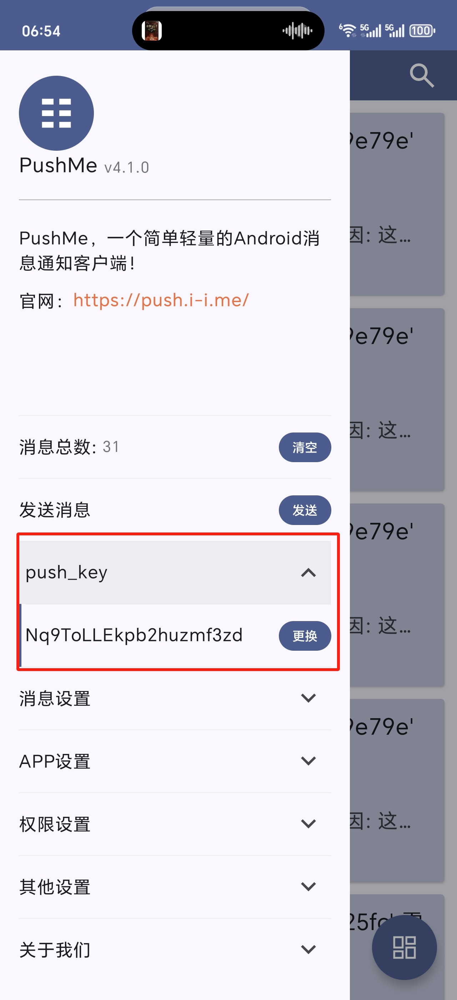
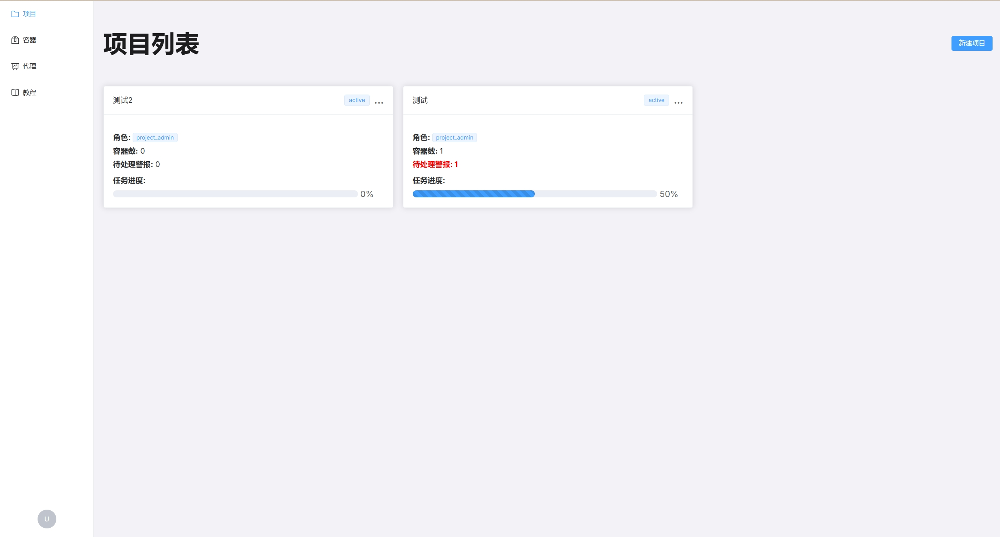

## 《Dispider 快速入门》

欢迎来到 Dispider🎉

本教程将帮助你快速掌握Dispider系统，高效管理分布式爬虫项目，让你一步迈入爬虫高手的世界😎


## 第一章：概念简介

### 1. Dispider 是什么？

Dispider 是一个专为解决现代爬虫项目开发与运维难题而设计的综合性管理平台。

**核心价值**:
它将传统爬虫项目中繁琐的 **服务器部署**、**任务分发**、**集群节点管理**、**IP代理维护** 等工作流程化、自动化，让你和你的团队能更专注于爬虫策略与数据本身。

**主要功能模块概览**:
- **项目 (Projects)**: 集中管理你的所有爬虫项目，包括代码、成员和配置。
- **任务 (Tasks)**: 强大的分布式任务系统，负责任务的定义、下发、调度和结果回收。
- **容器 (Containers)**: 基于 Docker 的运行时环境管理，为爬虫提供隔离、可复现的执行环境，并支持通过 VNC 直接访问（可以简单理解为一台小虚拟机）。
- **代理 (Proxies)**: 集成 Clash 代理池，简化动态IP代理的配置和使用。

### 2. 核心概念解析

在开始之前，理解以下几个核心概念至关重要：

- **项目 (Project)**
    - **定义**: 一个爬虫项目的逻辑集合。它包含了一组相关的爬虫代码、团队成员、独立的任务系统和分配给它的计算资源（容器）。
    - **类比**: 你代码仓库里的一个 `repository`。

- **容器 (Container)**
    - **定义**: 一个独立、轻量级的虚拟化环境（通常是 Docker 容器），用于实际运行你的爬虫程序。每个容器都是一个“工作节点”。
    - **价值**: 保证了开发环境和生产环境的一致性，并且可以轻松地水平扩展（增加或减少工作节点数量）。

- **任务系统 (Task System)**
    - **定义**: Dispider 的核心，由 **任务表 (Task Table)** 、 **结果表 (Result Table)** 以及 **调度中心 (Dispatcher)** 构成。它不是一个单一的功能，而是一整套工作流。
    - **工作流**:
        1.  **管理员** 在 Web 界面定义任务表和结果表的**数据结构**（有哪些列）。
        2.  **管理员** 将初始任务数据批量**导入**到任务表中。
        3.  **调度中心** 通过 `dispider` 库从任务表中**原子性地获取**一个任务。
        4.  **爬虫程序** 执行任务，并将爬取到的数据**提交**到结果表中。
        5.  **调度中心** 将结果表中的数据**批量导入**到任务表中，作为下一批任务的初始数据。

- **代理 (Proxy)**
    - **定义**: 用于在执行爬虫任务时隐藏真实 IP 或模拟不同地理位置的网络代理。
    - **集成**: Dispider 集成了 Clash，使你能够方便地管理和切换大量的代理节点。

### 3. 初次使用：注册与登录

现在，让我们开始使用 Dispider。

- **注册**: 在登录页面点击“注册”按钮。除了常规的用户名和密码，你还需要提供：
    - **PushMeKey**: 这是一个来自 `PushMe` 推送服务的个人密钥。提供它之后，当你的爬虫容器需要人工干预时，Dispider 就能直接向你的手机 App 发送实时通知。PushMeKey在App中生成，需要先下载并安装[PushMe](https://push.i-i.me/docs/download)。

    
- **登录**: 使用你的凭据登录系统。成功后，你将看到项目仪表盘主界面。

## 第二章：项目管理

项目是 Dispider 中所有工作的起点和核心。本章将指导你如何管理项目。

### 1. 项目仪表盘

登录后你看到的第一个页面就是项目仪表盘。

- **功能**: 这里会以卡片形式列出所有你被授权访问（作为成员或所有者）的项目。
- **快速浏览**: 你可以快速地看到每个项目的名称、描述和基本状态，方便你直接进入特定的工作空间。



### 2. 创建你的第一个爬虫项目

一个新项目就是你新爬虫任务管理入口。

- **操作**: 点击仪表盘右上角的“新建项目”按钮。
- **填写信息**:
    - **项目名称**: 为你的项目起一个清晰的名称，例如 `E-commerce Product Scraper`。
- **完成创建**: 点击“确定”后，系统将为你初始化项目所需的所有后端资源，点击项目卡片即可进入项目详情页面。
- **功能标签**: 详情页面分为**任务**、**代码**、**成员**等标签页，每个标签页分别管理不同功能。
    - **任务**: 任务系统管理入口，包括任务表、结果表的初始化、任务进度的监控。
    - **代码**: 爬虫代码的上传、更新入口。
    - **成员**: 人员管理入口，负责项目成员邀请与管理。


## 第三章：任务系统

本章讲解如何配置和利用 Dispider 强大的任务系统进行爬虫任务管理。

### 1. Dispider 任务系统工作流概览

在操作之前，我们先深入理解其工作流：

- **分离设计**: Dispider 将“你要爬什么”（任务）和“你爬到了什么”（结果）明确分离开。这通过两个独立的、可自定义结构的数据库表来实现：**任务表**和**结果表**。
- **角色分工**:
    - **管理员 (你)**: 负责定义这两张表的“长相”（即有哪些列），并把任务数据“喂”给系统。
    - **调度中心 (Dispider 后端)**: 像一个物流指挥，确保每个包裹地址（任务）只被一辆车（爬虫）通过（领取），并登记好车辆送回来的货物（结果）。
    - **爬虫工作节点 (你的爬虫脚本)**: 像一辆辆的货车，不断地去调度中心领包裹地址，然后把货物运回来。

### 2. 初始化你的数据表

进入项目详情页后，切换到 **"任务"** 标签页。你会看到两个主要的初始化区域。

#### 步骤一：定义并下发任务

这是整个项目的起点。你需要告诉 Dispider “爬什么”。

1.  **准备 `tasks.csv` 文件**:
    在本地创建一个 CSV 文件。**文件的表头 (header) 将成为任务表的列名**，每一行数据则是一条初始任务。

    *示例 `tasks.csv`*:
    | url                             | category    | priority |
    | ------------------------------- | ----------- | -------- |
    | http://example.com/products/1   | electronics | high     |
    | http://example.com/products/2   | books       | medium   |
    | http://example.com/products/3   | electronics | high     |

2.  **上传并初始化**:
    - 在“初始化任务表”卡片中，点击“选择CSV文件”并选中你准备好的 `tasks.csv`（名字其实无所谓，但最好不要有中文）。
    - 点击“**初始化并填充**”按钮。
    - Dispider 会完成两件事：
        1.  创建一个名为 `project_{id}_tasks` 的数据库表，其列正是你的 CSV 表头。
        2.  将 CSV 中的所有数据行插入到这个表中，作为待处理任务。

#### 步骤二：定义结果表结构

现在，你需要告诉 Dispider “爬到的数据应该长什么样子”。

1.  **准备 `results.csv` 文件**:
    同样，在本地创建一个 CSV 文件。但对于结果表，**Dispider 只关心文件的表头 (header)**，文件内容会被忽略。表头定义了结果数据的存储字段。

    *示例 `results.csv`*:
    | product_name | price | stock | scraped_at |
    | ------------ | ----- | ----- | ---------- |
    | Product 1    | 100   | 100   | 2021-01-01 |
    | Product 2    | 200   | 200   | 2021-01-02 |
    | Product 3    | 300   | 300   | 2021-01-03 |

在这个例子中，你定义了爬取结果需要包含 `product_name`, `price`, `stock`, `scraped_at` 四个字段。

2.  **上传并初始化**:
    - 在“初始化结果表”卡片中，选择你准备好的 `results.csv`（名字其实无所谓，但最好不要有中文）。
    - 点击“**初始化**”按钮。
    - Dispider 会创建一个名为 `project_{id}_results` 的数据库表，其列完全由你的 CSV 表头定义。

#### 重要提示！！！
由于Dispider数据库内部会使用这些列名，所以在初始化任务表和结果表时请不要使用这些列名:

<div style="color: red; font-weight: bold; font-size: 20px;">id, status, worker_id, claimed_at, retry_count, note</div>

### 3. 监控任务状态

初始化完成后，页面下方的“数据表状态”区域将变得非常有用。

- **任务完成度**: 一个直观的进度条，显示 `(已完成任务数 / 总任务数)` 的百分比。
- **结果总数**: 显示结果表中已成功存入的数据总行数。
- **刷新状态**: 点击数据表状态区域右上角的刷新按钮，可以获取最新的统计数据。
- **列定义**: 清晰地展示当前任务表和结果表分别包含哪些字段，方便你随时确认表结构是否符合预期。


## 第四章：容器管理

容器是你的爬虫代码实际运行的地方。本章我们将学习如何管理和操作支撑爬虫运行的容器集群。

### 1. 容器集群视图

在左侧主导航栏点击“容器”，即可进入容器集群的全局管理视图。

- **筛选与查看**:
    - **项目筛选**: 你可以只查看特定项目的容器，方便管理。
    - **状态筛选**: 快速过滤出“运行中”或需要你关注的“待干预”状态的容器。
- **状态解读**:
    - `running`: 容器正常运行。
    - `manual` (待干预): 一个特殊状态，当你的爬虫脚本主动上报了需要人工介入的严重错误时出现。**这个状态会触发 PushMe 消息通知**。

### 2. 核心操作

对于列表中的每一个容器，你都有一系列强大的操作按钮：

- **创建容器**: 页面右上角的按钮，点击后可以为指定项目**批量创建**一个新的或多个容器实例，这是实现水平扩展、提升爬取效率的关键。
- **重启 (Restart)**: 强制重新启动容器。这对于应用新的代码或配置非常有用。
- **停止 (Stop)**: 停止正在运行的容器，其状态会变为 `exited`。
- **销毁 (Destroy)**: **这是一个危险操作**。它会彻底停止并删除容器，所有未保存的数据都会丢失。
- **VNC**: **Dispider 的杀手级功能**。点击后会直接在新标签页打开该容器的远程桌面，允许你像操作自己电脑一样在容器内部进行调试、观察浏览器行为或手动运行脚本。
- **刷新 (Refresh)**: 手动上报该容器的状态为 `running`。当你通过 VNC **解决了“待干预”的问题**后，点击此按钮可以清除 `manual` 状态，让系统知道它已恢复正常。

### 3. 启动爬虫

如果每个容器启动后都要我们手动来启动python爬虫，那也未免太麻烦了。

好在Dispider已经为我们准备好了一切。

每一个容器在启动时都会**自动**的在其命令行窗口中执行python main.py这个指令。

我们只需要在项目详情页面上传自己的爬虫代码包即可（代码包必须为**zip**格式，其根目录中必须包含**main.py**这个入口文件）。


## 第五章：代理管理

对于需要大规模抓取或应对反爬策略的项目，一个健壮的代理池是成功的基石。Dispider 集成了强大的 Clash 内核，并提供了一套完整的健康监控和管理系统。

### 1. 健康监控面板

这是代理管理页面的核心，它提供了系统健康状况的宏观视图。

- **系统健康摘要**:
    - **系统状态**: 根据健康率，分为健康、降级、不健康、错误四个等级。
    - **健康率**: 当前可用的健康代理组占总数的百分比。
    - **代理组统计**: 快速了解有多少代理组处于健康、不健康或被临时拉黑的状态。
    - **容器统计**: 显示当前有多少活跃容器，以及它们与代理组的映射关系数量。
- **刷新机制**:
    - **刷新数据**: 手动触发一次所有健康指标的重新计算。
    - **自动刷新**: 默认开启，每30秒自动更新一次健康数据，让你实时掌握系统状态。

### 2. 快速操作（自动化运维）

这是一组非常强大的全局运维工具，用于快速处理常见问题：

- **重新分配所有不健康容器**: 一键命令，系统会自动为所有当前映射到“不健康”代理组的容器，重新分配一个健康的代理组。
- **清理过期黑名单**: 自动将已达到黑名单时限的代理组从小黑屋中释放出来，让它们重新接受健康检查。
- **重新初始化服务**: 当你对系统进行了底层修改后，点击此按钮可以重启整个健康监控服务。
- **运行系统诊断**: 触发一次全面的系统体检。

### 3. 诊断与状态

当你点击“运行系统诊断”后，下方会弹出两个信息卡：

- **Clash 服务状态**: 显示 Dispider 内置的 Clash 服务的核心信息，如版本、响应时间、代理总数、运行模式等。如果这里出现错误，说明代理服务本身出了问题。
- **系统诊断结果**: 展示体检报告，包括发现的**问题列表**和给出的**修复建议**，帮助你快速定位并解决问题。

### 4. 细节与微操

- **代理组详细状态**:
    - 你可以在这里展开查看**每一个**代理组的详细状态，包括响应时间、失败次数、是否被拉黑、以及黑名单的到期时间。
    - 对于被拉黑的代理组，你可以点击“**解除黑名单**”按钮进行手动干预。
- **容器代理映射**:
    - 这张表清晰地展示了“哪个爬虫容器正在使用哪个代理组”。
    - 如果你发现某个容器行为异常，可以点击“**重新分配**”按钮，立即为它更换一个新的代理组，而无需影响其他容器。

### 5. 配置管理 (管理员)

这部分功能通常由超级管理员使用。

- **上传供应商配置**: 你可以将从代理服务商处获得的 Clash 配置文件（`.yml`格式）上传到 Dispider。
- **刷新 Clash 配置**: Dispider 会合并所有上传的供应商配置，生成一个最终配置，并**热加载**到 Clash 服务中，整个过程无需重启，服务不中断。

---

## 第六章：开发实战

本章面向爬虫开发者，讲解如何在你的 Python 爬虫脚本中，使用 `dispider` 客户端工具与 Dispider 系统进行高效交互。

### 1. 认识 `dispider` 客户端

- **它是什么？**
    `dispider` 是一个预装在所有 Dispider 爬虫容器环境中的 Python 工具包（类似pandas、requests等）。它封装了与 Dispider 后端所有核心 API 的交互逻辑。

- **它的价值？**
    它让你完全不必关心如何进行用户认证、如何构造 API 请求、如何以线程安全的方式获取任务、如何上报状态等底层细节。你只需要调用几个简单的方法，就能融入 Dispider 的分布式体系，从而可以 **100% 专注于爬虫本身的业务逻辑**（例如：页面解析、数据清洗等）。

### 2. 在爬虫脚本中集成 `dispider`

在你的爬虫主程序（例如 `main.py`）中，集成 `dispider` 非常简单。

#### 初始化

```python
# 导入dispider客户端
from dispider import Dispider

# 配置你的账号密码
DISPIDER_USER = "admin"
DISPIDER_PASS = "123456"

# 初始化客户端
# 客户端会自动处理登录和 Token 管理
client = Dispider(username=DISPIDER_USER, password=DISPIDER_PASS)

```

#### 自动配置

`Dispider` 客户端在设计上就考虑到了容器化运行的环境。在初始化时，它会自动从容器的环境变量中读取两个至关重要的信息：
- `PROJECT_ID`: 告诉客户端当前属于哪个项目，确保它从正确的任务表中获取任务。
- `WORKER_ID`: 唯一标识当前这个爬虫实例（容器），这是实现原子化任务获取的关键。

你无需手动配置这些。

### 3. 核心开发循环

一个典型的爬虫工作循环如下：

1.  **循环获取任务**
    ```python
    # get_next_task() 是一个阻塞操作（如果配置了），但通常我们自己写循环
    while True:
        task = client.get_next_task()
        if not task:
            print("没有更多任务，爬虫退出。")
            break
        
        # task 是一个字典，包含了任务ID和在第三章定义的任务数据
        # {'id': 123, 'data': {'url': 'http://...', 'category': 'electronics', ...}}
        # 取出返回数据中的id字段
        task_id = task.get('id')
        # 取出返回数据中的data字段
        task_data = task.get('data')

        try:
            # ... 在这里执行你的核心爬虫逻辑 ...
            # 假设你的爬虫逻辑是根据url字段来爬取数据
            # 那么你只需要在爬虫逻辑中取出task_data['url']字段即可
            scraped_data = your_scraper_function(task_data['url'])
            
            # 成功后提交结果
            client.submit_task_result(scraped_data)
            print(f"任务 {task_id} 完成并提交结果。")

        except Exception as e:
            # 失败后报告错误
            client.report_task_failure(str(e))
            print(f"任务 {task_id} 失败: {e}")

    ```

#### 获取任务: `get_next_task()`
- 这是一个**原子操作**。Dispider 后端保证，即使有100个爬虫实例同时调用此方法，同一个任务也只会被分发给其中一个实例，绝不会重复。
- 当任务表中所有状态为 `pending` 的任务都被处理完毕后，此方法将返回 `None`。这是你判断爬取工作是否完成的标志。

#### 提交结果: `submit_task_result(result_data)`
- 当你的爬虫成功获取到数据后，调用此方法。
- `result_data` 必须是一个字典，其 `keys` 必须与你在第三章 **“步骤二：定义结果表结构”** 中设置的列名完全对应。
- Dispider 后端接收到数据后，会自动将对应的任务状态更新为 `completed`。

    *示例*:
    ```python
    # 假设结果表有 product_name, price, stock 三列
    result = {
        "product_name": "Awesome Widget",
        "price": "99.99",
        "stock": "150"
    }
    client.submit_task_result(result)
    ```

#### 报告失败: `report_task_failure(error_message)`
- 当爬虫在执行过程中遇到任何异常（网络错误、解析失败、IP被封等），你应该在 `except` 块中调用此方法。
- Dispider 后端会记录失败次数。默认重试策略下：
    - 如果失败次数 < 3次，任务状态会被重置为 `pending`，以便其他爬虫实例可以重新尝试。
    - 如果失败次数 ≥ 3次，任务状态会被标记为 `failed`，不再进行尝试。
- `error_message` 参数是可选的，但强烈建议提供，它能帮助你后续排查问题。

#### 高级功能：报告紧急状态 `report_needs_manual_intervention`

当你的爬虫遇到无法通过代码逻辑自动恢复的严重问题时（例如，网站弹出复杂的验证码、IP被彻底封禁、登录逻辑大改版），你可以主动向系统报告，请求人工干预。

```python
# 在你的主循环的 except 块中
except Exception as e:
    error_info = f"{type(e).__name__}: {e}"
    # 判断错误是否需要人工介入
    if "captcha" in error_info.lower() or "blocked" in error_info.lower():
        # 发送需要人工干预的报告，这将触发 PushMe 通知
        client.report_needs_manual_intervention(f"任务 #{task_id} 需要人工干预: {error_info}")
        print(f"任务 #{task_id} 已报告需要人工干预。")
    else:
        # 对于普通错误，只报告失败
        client.report_task_failure(error_info)
        print(f"任务 #{task_id} 失败: {error_info}")

```

调用 `client.report_needs_manual_intervention(message)` 方法后：
1.  Dispider 后端会记录这个紧急状态。
2.  系统会使用你在注册时提供的 `pushme_key`，向你的手机发送一条包含 `message` 内容的推送通知。
3.  收到通知后，你就可以及时通过 VNC 连接到对应的容器进行手动调试。

### 4. 完整代码示例

下面是一个最小化但完整的 `main.py` 脚本，你可以将其作为你自己爬虫项目的模板。

```python
import time
import random
from dispider import Dispider
import os

# 配置你的账号密码
DISPIDER_USER = "admin"
DISPIDER_PASS = "123456"

# --- 模拟你的爬虫函数 ---
# 这个函数宏观上看就是输入从任务表中获取的任务数据一番操作后获得与结果表结构匹配的爬取结果并返回
def my_awesome_scraper(url: str) -> dict:
    """
    一个模拟的爬虫函数，它接收一个URL，并返回一个包含虚构产品信息的数据字典。
    在真实场景中，这里会包含 requests/httpx, BeautifulSoup/Scrapy/Playwright 等库的调用。
    """
    print(f"正在爬取 URL: {url}...")
    time.sleep(random.uniform(0.5, 2.0)) # 模拟网络延迟

    # 模拟一个可能发生的错误
    if "products/fail" in url:
        raise ConnectionError("模拟网络连接失败")

    # 成功爬取，返回结构化数据
    # 注意：这里的 key 必须与你在 Dispider UI 中定义的结果表列名一致
    return {
        "product_name": f"Product from {url.split('/')[-1]}",
        "price": round(random.uniform(10, 500), 2),
        "stock": random.randint(0, 100),
        "scraped_at": time.strftime("%Y-%m-%d %H:%M:%S")
    }

# --- Dispider 客户端集成主逻辑 ---
def main():
    """
    主函数，初始化 Dispider 客户端并启动任务处理循环。
    """
    try:
        # 1. 初始化 Dispider 客户端
        # 推荐将用户名和密码存储在环境变量中，而不是硬编码
        client = Dispider(
            username=DISPIDER_USER,
            password=DISPIDER_PASS
        )
        print("Dispider 客户端初始化成功。")

    except Exception as e:
        print(f"Dispider 客户端初始化失败: {e}")
        return

    # 2. 启动无限循环来处理任务
    print("开始任务处理循环...")
    while True:
        try:
            # 3. 获取下一个待处理任务
            task = client.get_next_task()

            # 如果没有任务，则结束循环
            if not task:
                print("所有任务已处理完毕，爬虫退出。")
                break
            
            task_id = task.get('id')
            task_data = task.get('data')
            print(f"接收到任务 #{task_id}，URL: {task_data.get('url')}")
            
            try:
                # 4. 执行爬虫逻辑
                # 假设你的爬虫逻辑是根据url字段来爬取数据
                # 那么你只需要在爬虫逻辑中取出task_data['url']字段即可
                # 将其作为参数传给你设计好的核心爬取函数
                scraped_data = my_awesome_scraper(task_data.get('url'))
                
                # 5. 提交成功的结果
                client.submit_task_result(scraped_data)
                print(f"任务 #{task_id} 成功，结果已提交。")

            except Exception as e:
                # 6. 报告任务失败
                error_info = f"{type(e).__name__}: {e}"
                client.report_task_failure(error_info)
                print(f"任务 #{task_id} 失败: {error_info}")

        except Exception as e:
            # 捕获获取任务时可能发生的更高级别的错误 (例如网络问题)
            print(f"任务处理循环中发生严重错误: {e}")
            # 等待一段时间再重试，避免在网络故障时快速刷爆日志
            time.sleep(10)


if __name__ == "__main__":
    main()

```

